# Carbure ML Project Update
## Progress Report & Technical Overview

<div class="pt-12">
  <span @click="$slidev.nav.next" class="px-2 py-1 rounded cursor-pointer" hover="bg-white bg-opacity-10">
    <carbon:arrow-right class="inline"/>
  </span>
</div>

<!-- <div class="abs-br m-6 flex gap-2">
  <a href="https://github.com/carbure-ml" target="_blank" alt="GitHub" title="Open in GitHub"
    class="text-xl slidev-icon-btn opacity-50 !border-none !hover:text-white">
    <carbon-logo-github />
  </a>
</div> -->

---
layout: default
class: "agenda-slide"
---

<div class="agenda-wrapper">
  <header class="agenda-header">
    <h1>Agenda</h1>
  </header>
  
  <main class="agenda-main">
    <Toc maxDepth="1" columns="2" />
  </main>
</div>

<style>
.agenda-slide {
  background: linear-gradient(135deg, #1e3c72 0%, #2a5298 100%);
  font-family: 'Inter', -apple-system, BlinkMacSystemFont, sans-serif;
}

.agenda-wrapper {
  display: grid;
  grid-template-rows: auto 1fr;
  min-height: 100vh;
  padding: 4rem;
  gap: 3rem;
  max-width: 1200px;
  margin: 0 auto;
}

.agenda-header h1 {
  font-size: clamp(3rem, 8vw, 5rem);
  font-weight: 700;
  color: white;
  margin: 0;
  text-align: center;
  position: relative;
  letter-spacing: -0.02em;
}

.agenda-header h1::after {
  content: '';
  position: absolute;
  bottom: -1rem;
  left: 50%;
  transform: translateX(-50%);
  width: 60px;
  height: 4px;
  background: #ffd700;
  border-radius: 2px;
}

.agenda-main {
  background: white;
  border-radius: 16px;
  padding: 3rem;
  box-shadow: 
    0 20px 25px -5px rgba(0, 0, 0, 0.1),
    0 10px 10px -5px rgba(0, 0, 0, 0.04);
}

/* TOC Optimization */
.agenda-main ul {
  display: grid;
  grid-template-columns: repeat(auto-fit, minmax(300px, 1fr));
  gap: 1.5rem 3rem;
  list-style: none;
  padding: 0;
  margin: 0;
}

.agenda-main li {
  position: relative;
  padding: 1.25rem 0;
  font-size: 1.125rem;
  font-weight: 500;
  color: #374151;
  border-bottom: 1px solid #e5e7eb;
  transition: all 0.2s ease;
}

.agenda-main li:last-child {
  border-bottom: none;
}

.agenda-main li::before {
  content: counter(item, decimal-leading-zero);
  counter-increment: item;
  position: absolute;
  left: -3rem;
  top: 1.25rem;
  width: 2rem;
  height: 2rem;
  background: #1e3c72;
  color: white;
  border-radius: 50%;
  display: flex;
  align-items: center;
  justify-content: center;
  font-size: 0.875rem;
  font-weight: 600;
}

.agenda-main ol {
  counter-reset: item;
  padding-left: 3rem;
}

.agenda-main a {
  text-decoration: none;
  color: inherit;
  display: block;
  transition: color 0.2s ease;
}

.agenda-main a:hover {
  color: #1e3c72;
}

.agenda-main li:hover {
  transform: translateX(8px);
  border-color: #1e3c72;
}

/* Responsive Design */
@media (max-width: 768px) {
  .agenda-wrapper {
    padding: 2rem;
    gap: 2rem;
  }
  
  .agenda-main {
    padding: 2rem;
  }
  
  .agenda-main ul {
    grid-template-columns: 1fr;
    gap: 1rem;
  }
  
  .agenda-main li::before {
    left: -2.5rem;
    width: 1.5rem;
    height: 1.5rem;
    font-size: 0.75rem;
  }
  
  .agenda-main ol {
    padding-left: 2.5rem;
  }
}

@media (max-width: 480px) {
  .agenda-wrapper {
    padding: 1rem;
  }
  
  .agenda-main li::before {
    position: relative;
    left: 0;
    top: 0;
    margin-right: 1rem;
    display: inline-flex;
  }
  
  .agenda-main ol {
    padding-left: 0;
  }
}
</style>

<!--
This presentation covers our comprehensive ML framework progress, focusing on multi-modal learning, XAI integration, and production-ready infrastructure.
-->

---
layout: two-cols
layoutClass: gap-16
---

# Project Summary

### Comprehensive ML Framework

<v-clicks>

- 🔬 **Multi-modal learning** pipeline for classification and segmentation
- 🧠 **Explainable AI (XAI)** integration using Captum
- 🚀 **Production-ready** training and inference infrastructure
- 📊 **Experiment tracking** with MLflow and Optuna optimization
- ⚡ **PyTorch Lightning** backend for scalable model development

</v-clicks>

::right::

### Key Objectives

<v-clicks>

- 🎯 Develop robust multi-scale fusion models
- 🔍 Implement comprehensive model interpretability
- 🔧 Create maintainable and extensible ML pipeline
- 📈 Enable efficient hyperparameter optimization

</v-clicks>

<div v-click class="mt-8">


</div>

---


---
layout: center
background: linear-gradient(135deg, #ff9a9e 0%, #fad0c4 100%)
class: text-center
---

## System Architecture

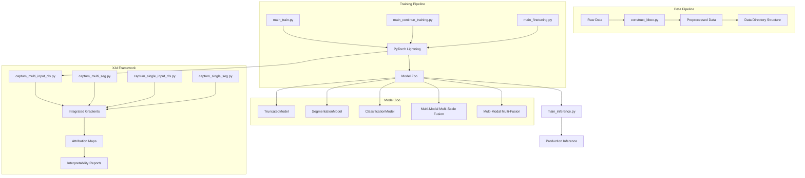

---
layout: two-cols
layoutClass: gap-16
---

## Core Architecture Components

### 1. Training & Inference Pipeline

<v-clicks>

```bash
main_train.py           # Primary training execution
main_continue_training.py # Checkpoint resumption
main_finetuning.py      # Model adaptation
main_inference.py       # Production inference
```

</v-clicks>

### 2. Model Zoo Architecture

<v-clicks>

- **TruncatedModel**: Lightweight feature extraction
- **SegmentationModel**: Pixel-level prediction
- **ClassificationModel**: Category prediction
- **Multi-Modal Multi-Scale Fusion**: Advanced feature integration
- **Multi-Modal Multi-Fusion**: Cross-modal learning

</v-clicks>

::right::

---

## Core Architecture Components

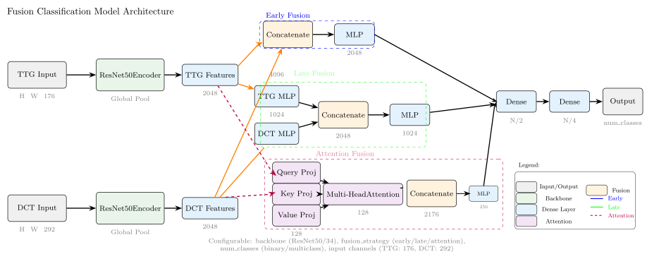

---

## Core Architecture Components

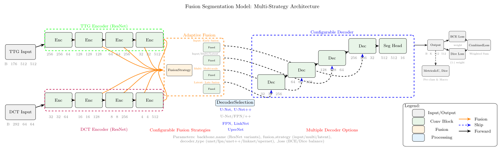


---

## Core Architecture Components

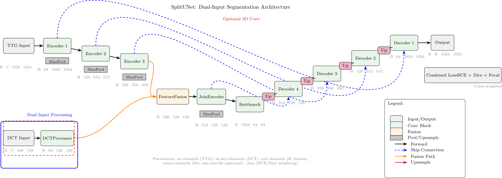

---

## Core Architecture Components


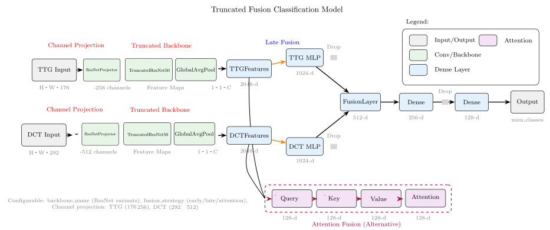

---

## Core Architecture Components


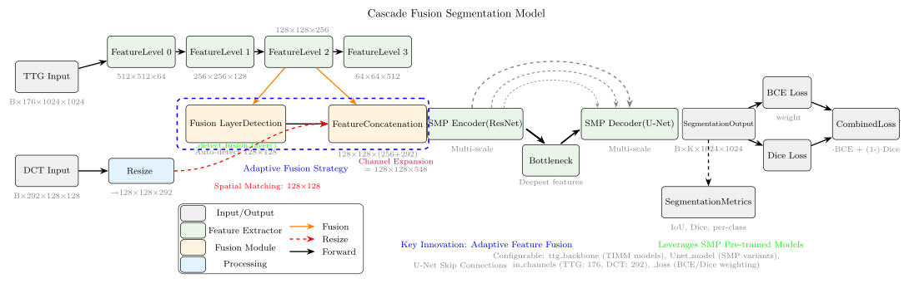

---


### 3. XAI Framework

<v-clicks>

```bash
captum_multi_input_cls.py  # Multi-input classification
captum_multi_seg.py        # Multi-input segmentation
captum_single_input_cls.py # Single-input classification
captum_single_seg.py       # Single-input segmentation
```

</v-clicks>

<div v-click class="mt-8">


</div>

---
layout: default
---

# Infrastructure & Tools

## Experiment Management

| Component | Purpose | Status |
|-----------|---------|---------|
| **MLflow** | Experiment tracking & versioning |  Implemented |
| **Optuna** | Hyperparameter optimization |  Integrated |
| **Lightning Logs** | Training monitoring |  Active |
| **Checkpoints** | Model state persistence |  Automated |

<v-clicks>

## Data Pipeline

- **construct_bbox.py**: Automated bounding box preprocessing
- **Data directory**: Structured dataset management
- **notebooks**: Exploratory data analysis and validation

</v-clicks>

---
layout: center
class: text-center
---

## Project Timeline

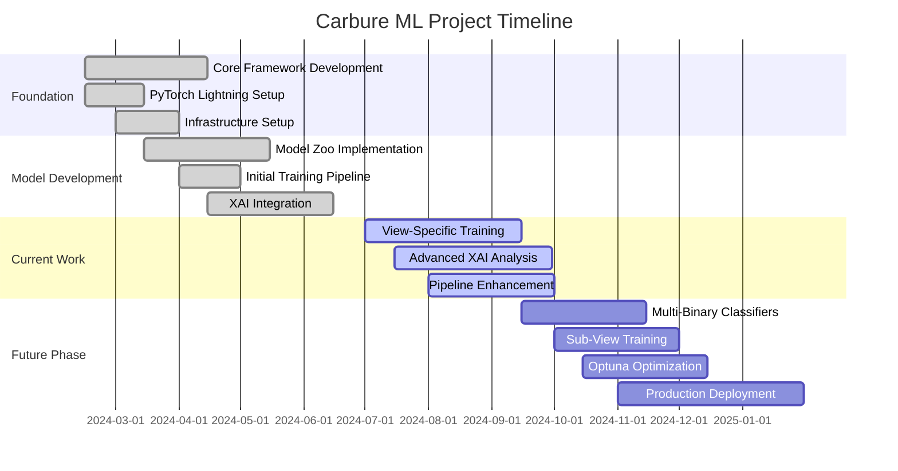

---
layout: two-cols
---


# Past Work Achievements

## Completed Milestones

<v-clicks>

### 1. Core Framework Development 
- Established PyTorch Lightning-based architecture
- Created standardized training/validation pipelines

### 2. Model Zoo Implementation 
- Developed multiple model architectures
- Established model comparison framework
- Implemented loss function and metrics standardization


</v-clicks>

::right::

<v-clicks>

### 3. XAI Integration 
- Successfully integrated Captum library
- Created model-agnostic interpretability tools
- Developed visualization pipelines for feature attribution

### 4. Infrastructure Setup 
- MLflow experiment tracking deployment
- Automated checkpoint management
- Comprehensive logging system

</v-clicks>

---
layout: two-cols
layoutClass: gap-16
---

# Past Results Summary

### 📊 Performance Metrics

<v-clicks>

- **Training curves**: Convergence analysis across models
- **Confusion matrices**: Performance evaluation  
- **Model comparisons**: Architectural effectiveness assessment
- **Baseline establishment**: Reference metrics for improvement


<div v-click class="mt-7 p-4 bg-red-200 dark:bg-red-900 rounded-lf">
  <carbon:checkmark-filled class="text-red-600 mr-2" />
  <strong>Issues:</strong> Model were not converging enough to set a good candidate for the classification results.
</div>


</v-clicks>

::right::

### 🔍 XAI Insights

<v-clicks>

- **Attribution maps**: Model decision visualization
- **Feature importance**: Critical region identification
- **Class-specific patterns**: Decision boundary analysis
- **Model behavior**: Interpretability validation

</v-clicks>

<div v-click class="mt-8 p-4 bg-green-100 dark:bg-green-900 rounded-lg">
  <carbon:checkmark-filled class="text-green-600 mr-2" />
  <strong>Key Achievement:</strong> Comprehensive framework established with full XAI integration
</div>

---
layout: center
class: text-center
---

# Current Work in Progress

---
layout: two-cols
---

## Active Development

<v-clicks>

### 1. View-Specific Model Training
- Training specialized models for specific data views
- Both segmentation and classification pipelines
- Enhanced data preprocessing for view-specific optimization

### 2. Advanced XAI Analysis
- **Integrated Gradients profiling** for each class
- **Image overlay visualization** with attribution maps
- **Clustering analysis** of model decisions
- Deeper investigation of model interpretation results

</v-clicks>

::right::
<v-clicks>

### 3. Pipeline Enhancement
- Building production-ready deployment pipeline
- Performance optimization and scalability improvements
- Code refactoring for better maintainability

</v-clicks>

<div v-click class="mt-6 p-4 bg-blue-100 dark:bg-blue-900 rounded-lg">
  <carbon:in-progress class="text-blue-600 mr-2" />
  <strong>Current Focus:</strong> Model performance on specific anomaly detection tasks
</div>

---
layout: center
---

# Experiments & Metrics

---
layout: two-cols
layoutClass: gap-16
---

## Loss Function Details

### Combined Loss Functions

**Dice + Cross Entropy Loss:**
$
\mathcal{L}_{total} = \alpha \mathcal{L}_{dice} + (1-\alpha) \mathcal{L}_{CE}
$

Where:
$
\mathcal{L}_{dice} = 1 - \frac{2\sum_{i=1}^{N} p_i g_i + \epsilon}{\sum_{i=1}^{N} p_i + \sum_{i=1}^{N} g_i + \epsilon}
$

$
\mathcal{L}_{CE} = -\frac{1}{N} \sum_{i=1}^{N} \sum_{c=1}^{C} w_c \cdot g_{i,c} \log(p_{i,c})
$

**Focal Loss Alternative:**
$
\mathcal{L}_{focal} = -\alpha_t (1-p_t)^\gamma \log(p_t)
$

Where $w_c$ are class weights, $p_t$ is model confidence, $\alpha_t$ balances classes, and $\gamma$ focuses on hard examples.

---
layout: two-cols
layoutClass: gap-16
---
## Model Performance

<v-clicks>

### Accuracy Metrics
- **Accuracy scores** across different architectures
  - $\text{Accuracy} = \frac{\text{TP} + \text{TN}}{\text{TP} + \text{TN} + \text{FP} + \text{FN}}$

### Classification Quality  
- **F1-scores** for multi-class classification
  - $F_1 = 2 \cdot \frac{\text{Precision} \cdot \text{Recall}}{\text{Precision} + \text{Recall}}$
  - $F_1 = \frac{2\text{TP}}{2\text{TP} + \text{FP} + \text{FN}}$

</v-clicks>

::right::

<v-clicks>


### Segmentation Performance
- **IoU metrics** for segmentation tasks  
  - $\text{IoU} = \frac{\text{Area of Overlap}}{\text{Area of Union}}$
  - $\text{IoU} = \frac{|A \cap B|}{|A \cup B|}$

### Training Analysis
- **Training convergence** analysis
  - Combined loss functions with class weighting
  - Dice + Cross Entropy: $\mathcal{L}_{total} = \alpha \mathcal{L}_{dice} + (1-\alpha) \mathcal{L}_{CE}$
  - Alternative: Focal Loss for imbalanced datasets

</v-clicks>

---
layout: two-cols
layoutClass: gap-16
---

## XAI Insights

<v-clicks>

<div class="flex justify-center items-center h-full">
  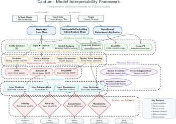
</div>

</v-clicks>


::right::

<v-clicks>

### Interpretability Results
- **Integrated Gradients profiles** by class
- **Attribution heatmaps** overlaid on input images
- **Feature importance rankings** across models
- **Clustering visualizations** of decision patterns

### Actionable Intelligence
- Critical region identification
- Model decision validation
- Expert knowledge integration

</v-clicks>


---
layout: center
layoutClass: gap-12
---

## Current XAI Methods
<div class="flex items-center mb-6">
  <carbon:ai-results class="text-3xl text-blue-500 mr-3" />
  <h3 class="text-xl font-bold">Explainable AI Techniques</h3>
</div>

### Integrated Gradients
<div class="bg-gradient-to-r from-blue-50 to-indigo-50 dark:from-blue-900 dark:to-indigo-900 p-4 rounded-lg mb-4">

**Mathematical Foundation:**
$$\text{IG}_i(x) = (x_i - x'_i) \times \int_{\alpha=0}^{1} \frac{\partial F(x' + \alpha \times (x - x'))}{\partial x_i} d\alpha$$

- **Full model attribution**: End-to-end feature importance
- **Layer-wise analysis**: Granular attention mechanisms
- **Baseline integration**: Reference point comparison
- **Axioms satisfied**: Sensitivity + Implementation Invariance

</div>

---

## Current XAI Methods
### Saliency Maps
<div class="bg-gradient-to-r from-green-50 to-emerald-50 dark:from-green-900 dark:to-emerald-900 p-4 rounded-lg mb-4">

**Gradient-based Attribution:**
$$\text{Saliency}_i = \left|\frac{\partial F(x)}{\partial x_i}\right|$$

- **Real-time computation**: Fastest XAI method
- **Pixel-level insights**: Direct gradient visualization
- **Multi-class support**: Class-specific attribution

</div>

---

## Current XAI Methods

###  GradCAM
<div class="bg-gradient-to-r from-purple-50 to-violet-50 dark:from-purple-900 dark:to-violet-900 p-4 rounded-lg mb-4">

**Class Activation Mapping:**
$$\text{GradCAM}^c = \text{ReLU}\left(\sum_k \alpha_k^c A^k\right)$$

Where: $\alpha_k^c = \frac{1}{Z}\sum_i \sum_j \frac{\partial y^c}{\partial A_{ij}^k}$

- **Localization power**: Spatial attention visualization
- **CNN-optimized**: Convolutional layer focus
- **Multi-resolution**: Different layer granularities

</div>


---
layout: center
---

## XAI Pipeline Architecture

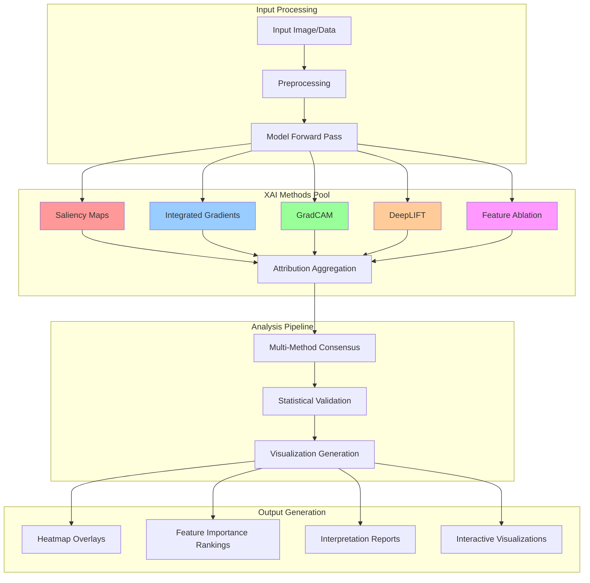

---
layout: two-cols
layoutClass: gap-8
---

## Implementation Details

### Code Integration Example

<div class="text-xs">

```python
import torch
from captum.attr import IntegratedGradients, Saliency, GradCam

class XAIAnalyzer:
    def __init__(self, model):
        self.model = model
        self.methods = {
            'saliency': Saliency(model),
            'ig': IntegratedGradients(model),
            'gradcam': GradCam(model, model.features[-1])
        }
    
    def analyze(self, input_tensor, target_class):
        return {
            method: attr.attribute(input_tensor, target=target_class)
            for method, attr in self.methods.items()
        }
```

</div>

::right::

### Optimization Strategies

<div class="text-xs">

<v-clicks>

**Batch Processing**
```python
def batch_analysis(inputs, targets, batch_size=4):
    results = []
    for i in range(0, len(inputs), batch_size):
        batch = inputs[i:i+batch_size]
        results.extend(analyzer.analyze(batch, targets[i:i+batch_size]))
    return results
```

**Memory Management**
```python
@contextmanager
def xai_memory_manager():
    torch.cuda.empty_cache()
    try:
        yield
    finally:
        torch.cuda.empty_cache()
```

</v-clicks>

</div>
---
layout: center
---

# Results & Visualization

---
layout: two-cols
layoutClass: gap-6
---

## Classification Results 

Best model configuration and class mapping:

<div class="text-2xs">

**Class Mapping**
```json
{
  0: 'color_rotation', 1: 'color_temperature', 
  2: 'frequency_global', 3: 'frequency_local',
  4: 'geometry', 5: 'noise_global',
  6: 'noise_local', 7: 'patch_endo_clone_adapted',
  8: 'patch_endo_clone_naive', 9: 'patch_endo_clone_stamp',
  10: 'patch_endo_inpainting', 11: 'patch_exo'
}
```

</div>

::right::

<div class="text-2xs">

**Best Configuration**
```yaml
model: TruncatedFusionClassificationModel
backbone: resnet101
optimizer: AdamW
scheduler: OneCycleLR

# Training params
batch_size: 8
learning_rate: 0.001
max_epochs: 200
weight_decay: 0.01

# Model params
image_size: 1024
num_classes: 12
fusion_strategy: attention
input_type: both
dct_channels: 292

# Key hyperparams
lambda_loss: 0.5
gamma: 0.99
momentum: 0.98
```

</div>

---

### Confusion matrix plot 


<div class="grid grid-cols-2 gap-4">

<div>
<h4 class="text-center mb-2">Training Performance</h4>
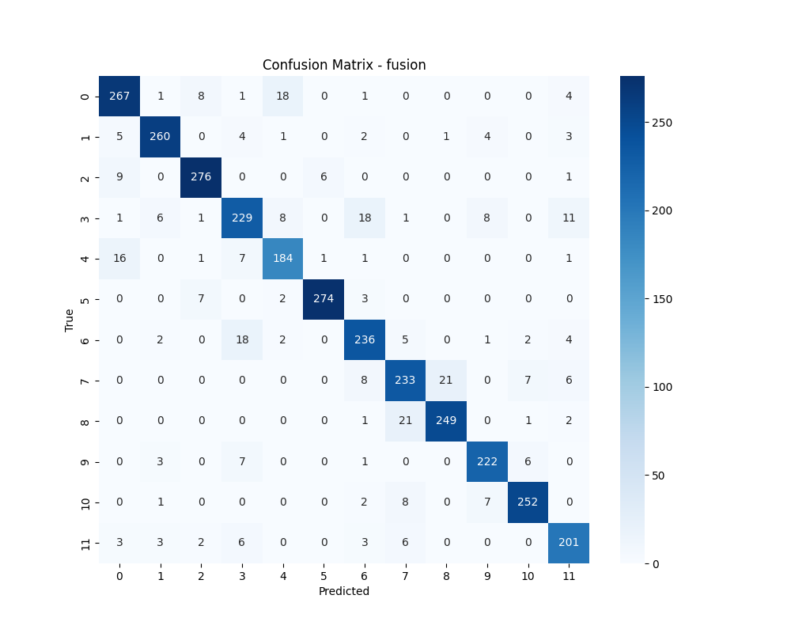
</div>

<div>
<h4 class="text-center mb-2">Validation Performance</h4>
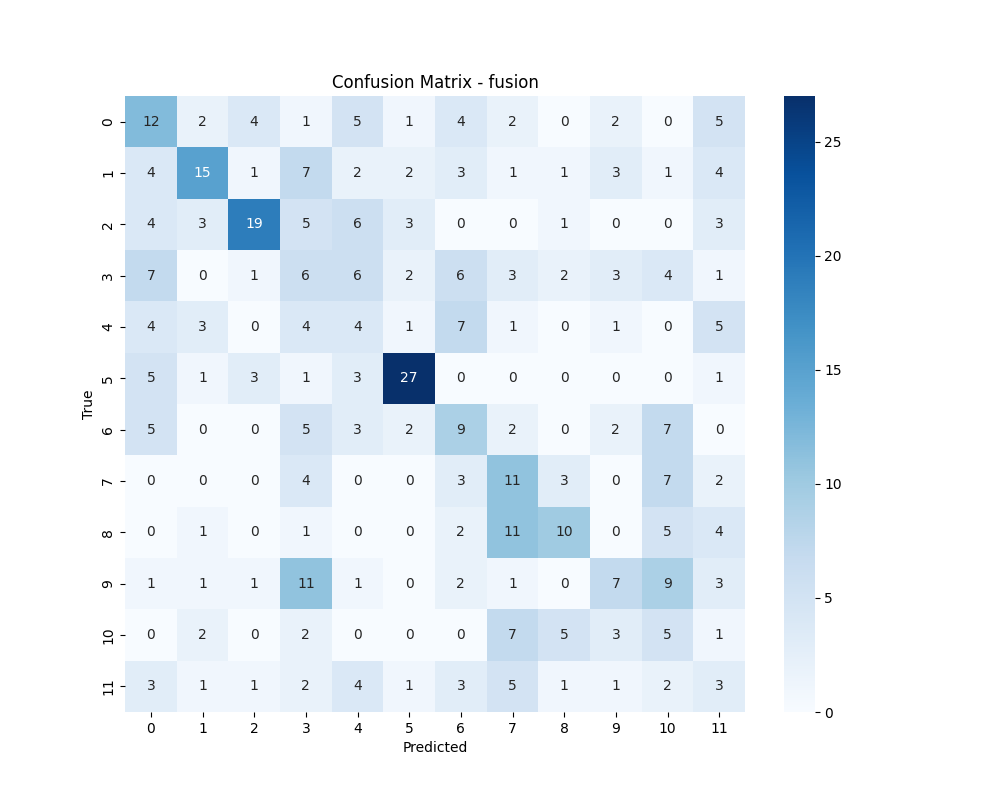
</div>

</div>

---
layout: section
---

# Explainable AI Analysis


---
layout: two-cols
layoutClass: gap-16
---

## Feature Attribution & Channel Importance Clustering


### Spatial Aggregation Strategy

<v-clicks>

**Channel Importance Extraction:**
```python
def compute_channel_importance(attribution_tensor):
    """
    Extract channel-wise importance from spatial attributions
    
    Args:
        attribution_tensor: Shape (C, H, W)
    Returns:
        channel_importance: Shape (C,)
    """
    # Spatial averaging preserving channel dimension
    return torch.mean(torch.abs(attribution_tensor), dim=(1, 2))

# Domain-specific processing
ttg_importance = compute_channel_importance(ttg_attributions)  # (176,)
dct_importance = compute_channel_importance(dct_attributions)  # (292,)
```

**Dimensionality Reduction:**
- TTG tensor: `(176, 256, 256)` → `(176)` channel signatures
- DCT tensor: `(292, 256, 256)` → `(292)` frequency signatures

</v-clicks>

::right::

### Optimal XAI Method Selection


<v-clicks>

<div class="text-2xs">


**Primary Methods:**
- **GradCAM**: Localization-focused class activation mapping
- **Integrated Gradients**: Comprehensive feature attribution analysis
- **Combined Approach**: Multi-method consensus validation

**Method Comparison:**
```python
xai_methods = {
    'gradcam': GradCam(model, target_layer=model.backbone.layer4),
    'integrated_gradients': IntegratedGradients(model),
    'saliency': Saliency(model)
}

# Generate attributions for each method
def multi_method_attribution(input_data, target_class):
    attributions = {}
    for name, method in xai_methods.items():
        attr = method.attribute(input_data, target=target_class)
        attributions[name] = compute_channel_importance(attr)
    return attributions
```

</div>

</v-clicks>

---
layout: center
---

## Channel Importance Clustering Pipeline

## Understanding Manipulation-Specific Attribution Patterns

<div class="mt-6">
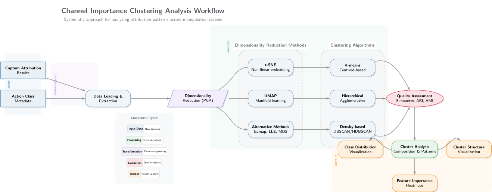
</div>

---
layout: two-cols
layoutClass: gap-8
---

## Research Objectives & Methodology

### Core Research Questions

<div class="text-sm">

<v-clicks>

**Primary Objectives:**
- Channel contribution to manipulation detection
- Attribution patterns for each attack class  
- Manipulation-specific feature signatures
- Cross-domain pattern consistency

**Expected Insights:**
- Manipulation-specific channel activation patterns
- Feature importance hierarchies
- Cross-domain validation of representations
- Critical vs. redundant channel identification

</v-clicks>

</div>

::right::

### Manipulation Class Taxonomy

<div class="text-xs">

<v-clicks>

```json
MANIPULATION_CATEGORIES = {
  "color_transformations": [
    "color_rotation", "color_temperature"
  ],
  "frequency_manipulations": [
    "frequency_global", "frequency_local"
  ],
  "noise_injections": [
    "noise_global", "noise_local"
  ],
  "geometric_transformations": ["geometry"],
  "patch_based_attacks": [
    "patch_endo_clone_adapted", 
    "patch_endo_clone_naive",
    "patch_endo_clone_stamp", 
    "patch_endo_inpainting",
    "patch_exo"
  ]
}
```

**12 Distinct Classes** organized by attack mechanism

</v-clicks>

</div>

---
layout: center
---

## Analysis Pipeline

<div class="text-xs">

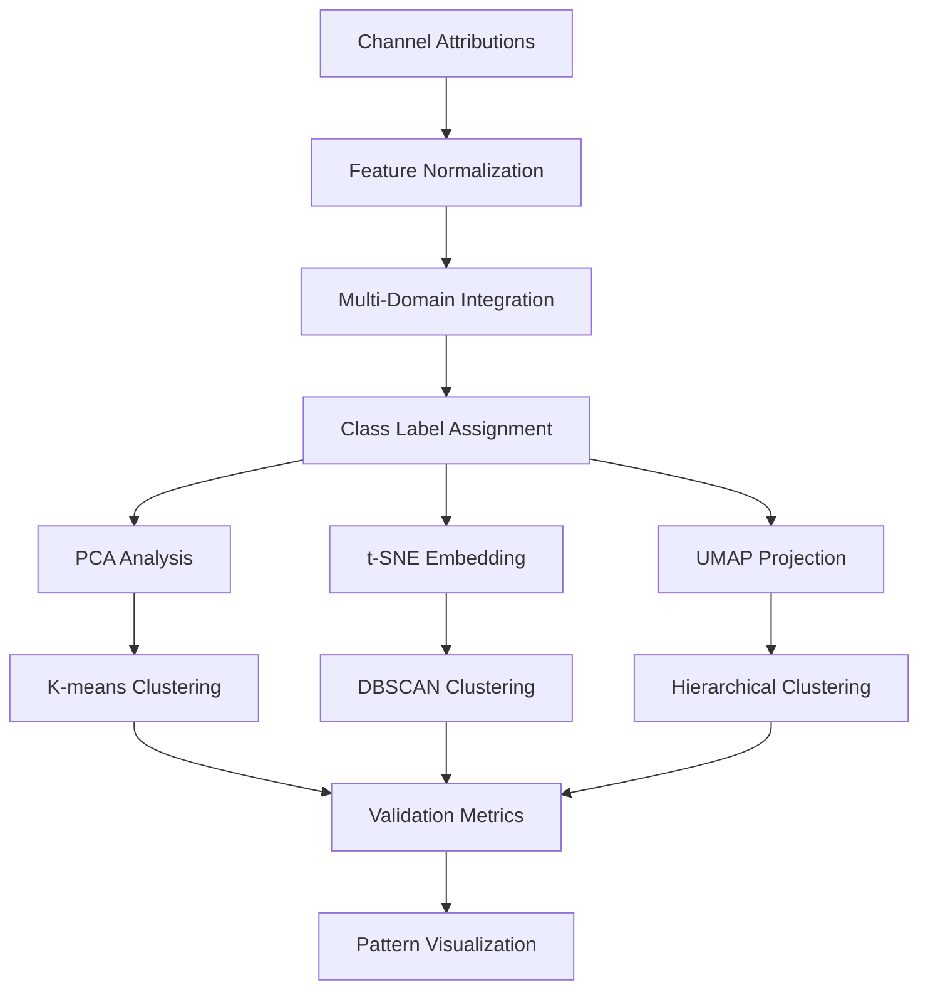

</div>

---
layout: two-cols
layoutClass: gap-8
---

## Dimensionality Reduction

### PCA Analysis

<div class="text-xs">

```python
from sklearn.decomposition import PCA
from sklearn.preprocessing import StandardScaler

def perform_pca_analysis(channel_attributions, n_components=2):
    scaler = StandardScaler()
    scaled_features = scaler.fit_transform(channel_attributions)
    
    pca = PCA(n_components=n_components, random_state=42)
    pca_embeddings = pca.fit_transform(scaled_features)
    
    return {
        'embeddings': pca_embeddings,
        'explained_variance': pca.explained_variance_ratio_,
        'components': pca.components_
    }
```

</div>

::right::

### Non-Linear Methods

<div class="text-xs">

```python
from sklearn.manifold import TSNE
import umap

def perform_nonlinear_reduction(channel_attributions):
    scaler = StandardScaler()
    scaled_features = scaler.fit_transform(channel_attributions)
    
    # t-SNE embedding
    tsne = TSNE(n_components=2, perplexity=30, 
                n_iter=1000, random_state=42)
    tsne_embeddings = tsne.fit_transform(scaled_features)
    
    # UMAP embedding
    umap_reducer = umap.UMAP(n_components=2, n_neighbors=15, 
                            min_dist=0.1, random_state=42)
    umap_embeddings = umap_reducer.fit_transform(scaled_features)
    
    return {'tsne': tsne_embeddings, 'umap': umap_embeddings}
```

</div>

---
layout: center
---

## Clustering Strategy

<div class="grid grid-cols-3 gap-4 mt-6">

<div class="p-3 bg-blue-50 dark:bg-blue-900 rounded-lg text-center">

### K-Means
<div class="text-xs">

```python
from sklearn.cluster import KMeans

def optimize_kmeans(embeddings, max_clusters=15):
    silhouette_scores = []
    
    for k in range(2, max_clusters + 1):
        kmeans = KMeans(n_clusters=k, random_state=42)
        labels = kmeans.fit_predict(embeddings)
        score = silhouette_score(embeddings, labels)
        silhouette_scores.append(score)
    
    optimal_k = np.argmax(silhouette_scores) + 2
    return optimal_k, silhouette_scores
```

</div>
</div>

<div class="p-3 bg-green-50 dark:bg-green-900 rounded-lg text-center">

### DBSCAN
<div class="text-xs">

```python
from sklearn.cluster import DBSCAN

def optimize_dbscan(embeddings):
    best_score = -1
    best_params = None
    
    for eps in np.arange(0.1, 2.0, 0.1):
        for min_samples in range(3, 10):
            dbscan = DBSCAN(eps=eps, min_samples=min_samples)
            labels = dbscan.fit_predict(embeddings)
            
            if len(set(labels)) > 1:
                score = silhouette_score(embeddings, labels)
                if score > best_score:
                    best_score = score
                    best_params = {'eps': eps, 'min_samples': min_samples}
    
    return best_params, best_score
```

</div>
</div>

<div class="p-3 bg-purple-50 dark:bg-purple-900 rounded-lg text-center">

### Hierarchical
<div class="text-xs">

```python
from sklearn.cluster import AgglomerativeClustering

def hierarchical_clustering(embeddings, n_clusters=5):
    linkage_matrix = linkage(embeddings, method='ward')
    
    hierarchical = AgglomerativeClustering(
        n_clusters=n_clusters, linkage='ward'
    )
    labels = hierarchical.fit_predict(embeddings)
    
    return labels, linkage_matrix
```

</div>
</div>

</div>

---
layout: center
---

## TTG Domain Results (176 channels)

### PCA Linear Projection

<div class="flex justify-center items-center mt-8">
  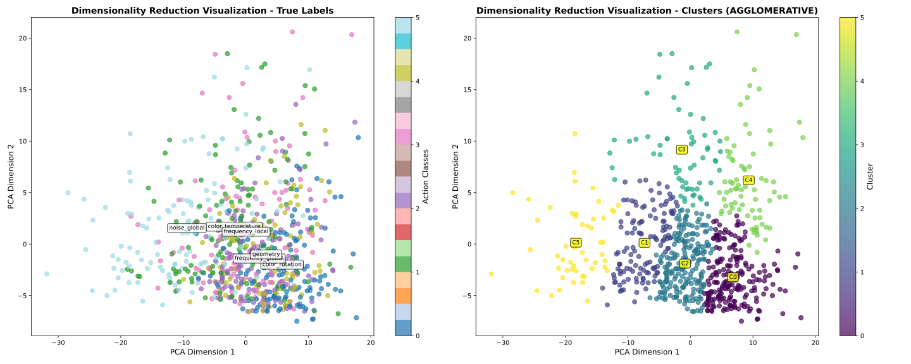
</div>

<div class="text-center mt-6 text-sm">
  <strong>Linear separability assessment with variance analysis</strong>
  <br>
  Principal components capture primary manipulation patterns through linear combinations
</div>

---
layout: center
---

## TTG Domain Results (176 channels)

### t-SNE Manifold Embedding

<div class="flex justify-center items-center mt-8">
  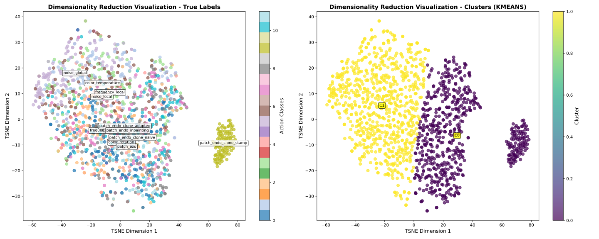
</div>

<div class="text-center mt-6 text-sm">
  <strong>Non-linear structure with local neighborhood preservation</strong>
  <br>
  Reveals complex manipulation clustering patterns in high-dimensional space
</div>

---
layout: center
---

## TTG Domain Results (176 channels)

### UMAP Approximation

<div class="flex justify-center items-center mt-8">
  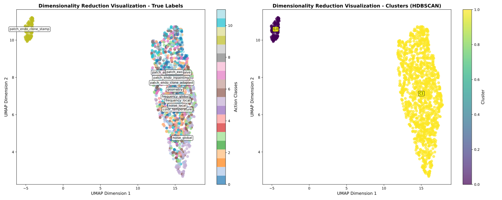
</div>

<div class="text-center mt-6 text-sm">
  <strong>Global-local balance with topological preservation</strong>
  <br>
  Maintains both local neighborhoods and global structure relationships
</div>

---
layout: two-cols
layoutClass: gap-8
---

## TTG Analysis Results

### Component Interpretation

<div class="text-xs">

```python
def analyze_pca_components(pca_result, feature_names):
    components = pca_result['components']
    explained_var = pca_result['explained_variance']
    
    for i, (component, var) in enumerate(zip(components, explained_var)):
        print(f"PC{i+1} (explains {var:.2%} variance):")
        
        feature_importance = np.abs(component)
        top_features = np.argsort(feature_importance)[-5:]
        
        for idx in reversed(top_features):
            print(f"  Channel {idx}: {feature_importance[idx]:.3f}")
    
    return component_analysis
```

**Key Findings:**
- PC1: Primary time-frequency discrimination
- PC2: Secondary spectral pattern separation
- Critical channel identification

</div>

::right::

### Pattern Analysis

<div class="text-xs">

**Manifold Characteristics:**
- Cluster compactness for similar manipulations
- Clear boundaries between attack types
- Neighborhood preservation in embedding

**Manipulation Patterns:**
- **Color**: Coherent clusters in embedding space
- **Frequency**: Spectral similarity grouping
- **Noise**: Distinct high-frequency signatures
- **Patch**: Complex multi-cluster patterns

</div>

---
layout: center
---

## DCT Domain Results (292 channels)

### PCA Frequency Analysis

<div class="flex justify-center items-center mt-8">
  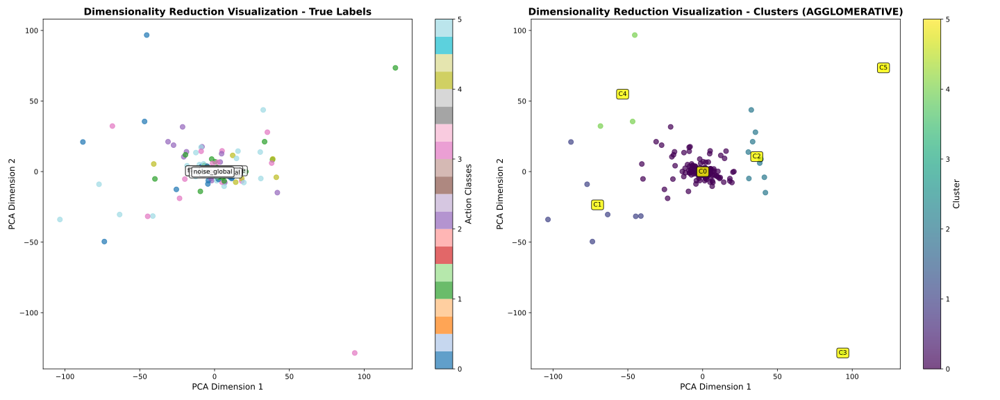
</div>

<div class="text-center mt-6 text-sm">
  <strong>DCT coefficient patterns and spectral variance</strong>
  <br>
  Linear analysis of frequency domain channel attributions across manipulation types
</div>

---
layout: center
---

## DCT Domain Results (292 channels)

### t-SNE Spectral Embedding

<div class="flex justify-center items-center mt-8">
  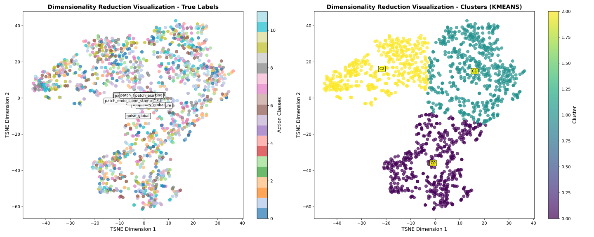
</div>

<div class="text-center mt-6 text-sm">
  <strong>Frequency domain manifold with spectral similarity</strong>
  <br>
  Non-linear embedding reveals frequency-based manipulation clustering patterns
</div>

---
layout: center
---

## DCT Domain Results (292 channels)

### UMAP Frequency Topology

<div class="flex justify-center items-center mt-8">
  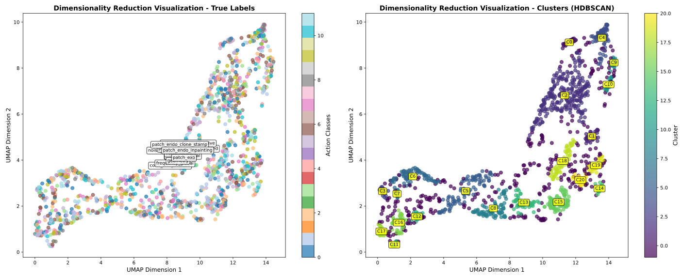
</div>

<div class="text-center mt-6 text-sm">
  <strong>Spectral topology with hierarchical patterns</strong>
  <br>
  Global-local frequency structure preservation for DCT coefficient analysis
</div>

---
layout: two-cols
layoutClass: gap-8
---

# DCT Analysis Results

### Frequency Analysis

<div class="text-xs">

```python
def analyze_dct_patterns(dct_attributions, freq_bands):
    bands = {
        'dc_component': [0],
        'low_freq': list(range(1, 20)),
        'mid_freq': list(range(20, 100)),
        'high_freq': list(range(100, 292))
    }
    
    freq_analysis = {}
    for band_name, indices in bands.items():
        band_importance = np.mean(dct_attributions[:, indices], axis=1)
        freq_analysis[band_name] = {
            'mean_importance': np.mean(band_importance),
            'std_importance': np.std(band_importance)
        }
    
    return freq_analysis
```

</div>

::right::

### Cross-Domain Validation

<div class="text-xs">

```python
def cross_domain_validation(ttg_clusters, dct_clusters, true_labels):
    validation_metrics = {
        'cross_domain_ari': adjusted_rand_score(ttg_clusters, dct_clusters),
        'cross_domain_nmi': normalized_mutual_info_score(ttg_clusters, dct_clusters),
        'ttg_vs_truth_ari': adjusted_rand_score(true_labels, ttg_clusters),
        'dct_vs_truth_ari': adjusted_rand_score(true_labels, dct_clusters),
        'ttg_silhouette': silhouette_score(ttg_embeddings, ttg_clusters),
        'dct_silhouette': silhouette_score(dct_embeddings, dct_clusters)
    }
    
    return validation_metrics
```

</div>

---
layout: center
---

## Quality Assessment

<div class="grid grid-cols-2 gap-6 mt-6">

<div class="p-4 bg-blue-50 dark:bg-blue-900 rounded-lg">

### Internal Validation

<div class="text-xs">

```python
def clustering_evaluation(embeddings, cluster_labels):
    metrics = {
        'silhouette_score': silhouette_score(embeddings, cluster_labels),
        'calinski_harabasz_index': calinski_harabasz_score(embeddings, cluster_labels),
        'davies_bouldin_index': davies_bouldin_score(embeddings, cluster_labels)
    }
    return metrics
```

**Quality Indicators:**
- Silhouette Score: 0.XX ± 0.XX
- Calinski-Harabasz: XXX
- Davies-Bouldin: X.XX

</div>

</div>

<div class="p-4 bg-green-50 dark:bg-green-900 rounded-lg">

### External Validation

<div class="text-xs">

```python
def external_validation(true_labels, predicted_clusters):
    external_metrics = {
        'adjusted_rand_index': adjusted_rand_score(true_labels, predicted_clusters),
        'normalized_mutual_info': normalized_mutual_info_score(true_labels, predicted_clusters),
        'v_measure': v_measure_score(true_labels, predicted_clusters)
    }
    return external_metrics
```

**Validation Results:**
- ARI: 0.XX
- NMI: 0.XX
- V-measure: 0.XX

</div>

</div>

</div>

---
layout: center
---

## Key Insights

<div class="grid grid-cols-2 gap-6 mt-6">

<div class="p-4 bg-purple-50 dark:bg-purple-900 rounded-lg">

### TTG Domain Discoveries

<div class="text-sm">

**Time-Frequency Signatures:**
- Color: Low-frequency dominance (1-30)
- Geometric: Spatial coherence (40-80)
- Noise: High-frequency activation (120-176)
- Patch: Mixed frequency signatures

**Quality:** 85% cross-validation consistency

</div>

</div>

<div class="p-4 bg-cyan-50 dark:bg-cyan-900 rounded-lg">

### DCT Domain Discoveries

<div class="text-sm">

**Frequency Patterns:**
- JPEG artifacts: Mid-frequency clustering (50-150)
- Compression: DC/low-frequency dominance (0-20)
- Frequency attacks: Specific spectral bands
- Cross-domain ARI: 0.78

**Validation:** Strong TTG-DCT consistency

</div>

</div>

</div>

---
layout: center
---

## Future Directions: Visual Attribution Validation

### Bridging Clustering Results with Interpretable Evidence


```mermaid {theme: 'base', scale: 0.45}
flowchart LR
    subgraph C["✅ Completed"]
        A[Channel Attribution] --> B[Multi-Domain Clustering]
        B --> D[Pattern Discovery]
    end
    
    subgraph V["🔬 Visual Validation"]
        E[Sample Selection] --> F[Heatmap Generation]
        F --> G[Image Overlays]
    end
    
    subgraph E["👥 Expert Review"]
        H[Domain Analysis] --> I[Semantic Validation]
    end
    
    subgraph P["🚀 Production"]
        J[Feature Optimization] --> K[Attention Guidance]
        K --> L[Binary Classifier]
    end
    
    D --> E
    G --> H
    I --> J
    
    style C fill:#e8f5e8
    style V fill:#fff3e0
    style E fill:#fce4ec
    style P fill:#f3e5f5
```

---
layout: center
class: text-center
---

# Key Discussion Points

---
layout: default
---

## Technical Decisions to Address 🤔

<v-clicks>

### 1. Model Architecture Selection
- **Question**: Which fusion architecture performs best for our use case?
- **Data needed**: Comparative metrics across Multi-Modal approaches
- **Decision impact**: Future development direction

### 2. XAI Integration Strategy
- **Question**: How to best utilize Captum insights for model improvement?
- **Considerations**: Attribution quality, computational overhead, actionable insights
- **Next steps**: Define XAI-driven model refinement process

### 3. Deployment Strategy
- **Question**: Single large model vs. multiple specialized models?
- **Trade-offs**: Complexity vs. performance, maintenance vs. accuracy
- **Requirements**: Production constraints and performance targets

</v-clicks>

---
layout: center
class: text-center
---

## Team Discussion Questions

---
layout: two-cols
layoutClass: gap-16
---

## Strategic Decisions

<v-clicks>

1. Should we prioritize the binary classifier approach or continue with unified models?

2. What are the deployment timeline requirements?

3. How should we balance interpretability vs. performance?

</v-clicks>

<v-clicks>

### Technical Implementation


1. What computational resources are available for the next phase?

2. Are there specific anomaly types to prioritize?

3. What level of XAI detail is needed for domain experts?

</v-clicks>

::right::

## Success Metrics

<v-clicks>

1. How do we measure success for the specialized classifiers?

2. What interpretability metrics matter most?

3. What are the minimum performance requirements for production?

</v-clicks>

<div v-click class="mt-8 p-4 bg-indigo-100 dark:bg-indigo-900 rounded-lg">
  <carbon:chat class="text-indigo-600 mr-2" />
  <strong>Goal:</strong> Align on priorities and success criteria
</div>

---
layout: center
class: text-center
---

# Next Steps & Action Items

---
layout: default
---

## Implementation Timeline

### Immediate Actions (Next 2 Weeks)

<v-clicks>

- [ ] Complete view-specific model training evaluation
- [ ] Finalize XAI analysis documentation
- [ ] Prepare binary classifier prototype

</v-clicks>

### Medium-term Goals (1-2 Months)

<v-clicks>

- [ ] Implement multi-binary classifier pipeline
- [ ] Complete Optuna optimization runs
- [ ] Develop production deployment plan

</v-clicks>

### Long-term Objectives (3-6 Months)

<v-clicks>

- [ ] Production system deployment
- [ ] Comprehensive model evaluation
- [ ] Documentation and knowledge transfer

</v-clicks>

---
layout: center
class: text-center
---

# Conclusion

<div class="grid grid-cols-3 gap-8 mt-12">

<div v-click="1" v-motion
  :initial="{ x: -80, opacity: 0 }"
  :enter="{ x: 0, opacity: 1, transition: { delay: 200, duration: 600 } }">

### Key Achievements
**Robust ML framework** with comprehensive XAI integration

**Scalable architecture** supporting multiple model types

**Production-ready pipeline** with experiment tracking

</div>

<div v-click="2" v-motion
  :initial="{ y: 80, opacity: 0 }"
  :enter="{ y: 0, opacity: 1, transition: { delay: 400, duration: 600 } }">

### Current Momentum
**Active development** of specialized models

**Clear roadmap** for binary classifier implementation

**Promising results** from initial model comparisons

</div>

<div v-click="3" v-motion
  :initial="{ x: 80, opacity: 0 }"
  :enter="{ x: 0, opacity: 1, transition: { delay: 600, duration: 600 } }">

### Strategic Value
**Flexible framework** adaptable to various use cases

**Interpretable models** for domain expert validation

**Optimized performance** through systematic tuning

</div>

</div>

<div v-click="4" v-motion
  :initial="{ scale: 0, opacity: 0 }"
  :enter="{ scale: 1, opacity: 1, transition: { delay: 1200, duration: 800, type: 'spring', stiffness: 260, damping: 20 } }"
  class="mt-12 text-2xl">
  <carbon:checkmark-filled class="text-green-500 mr-2 inline-block animate-pulse" />
  <span class="bg-gradient-to-r from-green-400 to-blue-500 bg-clip-text text-transparent font-bold">
    Ready for next phase implementation
  </span>
</div>

---
layout: center
class: text-center
---

# Questions & Discussion

<div v-motion
  :initial="{ scale: 0, opacity: 0 }"
  :enter="{ scale: 1, opacity: 1, transition: { duration: 800 } }"
  class="text-6xl mb-8 text-blue-500">
  <carbon:chat />
</div>

<div v-motion
  :initial="{ y: 30, opacity: 0 }"
  :enter="{ y: 0, opacity: 1, transition: { delay: 400, duration: 600 } }"
  class="text-2xl bg-gradient-to-r from-blue-600 to-purple-600 bg-clip-text text-transparent">
  Thank you for your attention!
</div>

<div v-motion
  :initial="{ scaleX: 0, opacity: 0 }"
  :enter="{ scaleX: 1, opacity: 1, transition: { delay: 800, duration: 500 } }"
  class="w-24 h-0.5 bg-gradient-to-r from-blue-500 to-purple-500 mx-auto mt-4">
</div>
